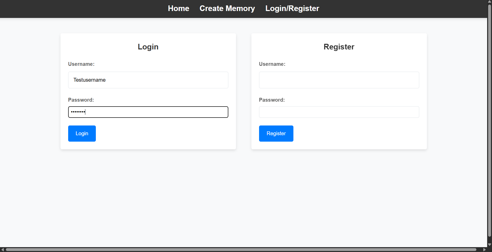
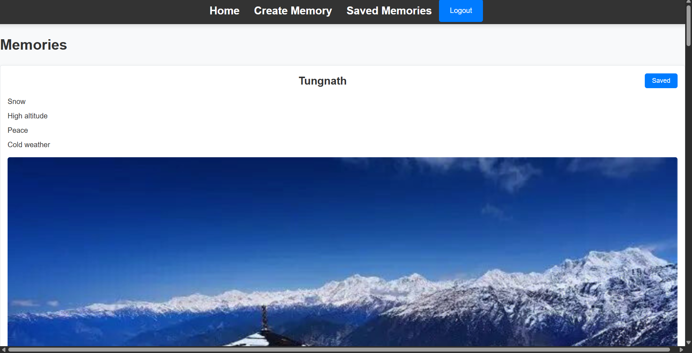

# 🌍 Your Memories

**Your Memories** is a full-stack travel memory web application that helps users **create** and **explore** travel memories.

Built for travel enthusiasts who want to share their own travel experiences and also discover new destinations recommended by others.

---

## 🔗 Live Demo

👉 [https://your-memories.onrender.com](https://your-memories.onrender.com)

---

## ✨ Features

- 🧳 Share your personal travel memories with title, description, tags, and image  
- 🔐 JWT-based Login and Registration system  
- 👀 View memories shared by other users
- ✍️ Save memories shared by other users after logging in
- 💻 Responsive and user-friendly UI using ReactJS  
- 🔄 RESTful API for smooth data exchange between frontend and backend  
- 📁 MongoDB integration for efficient storage and retrieval of memories  

---

## 🛠️ Tech Stack

| Layer        | Technology         |
|--------------|--------------------|
| Frontend     | ReactJS            |
| Backend      | NodeJS, ExpressJS  |
| Database     | MongoDB            |
| Auth         | JSON Web Tokens    |
| Hosting      | Render |

---

## 🔧 Installation

### 1. Clone the Repository

```bash
git clone https://github.com/anurag2118/your-memories.git
cd your-memories
```

### 2. Setup Backend

```bash
cd server
npm install
```

Create a `.env` file inside the `server/` folder and add the following:

```
MONGO_URI=your_mongo_connection_string
JWT_SECRET=your_jwt_secret
```

Then start the backend server:

```bash
npm run dev
```

### 3. Setup Frontend

```bash
cd ../client
npm install
npm start
```

The app will be running at `http://localhost:3000`

---

## 💡 Motivation

As someone who loves traveling, I often found it hard to discover new places.  
**Your Memories** solves this by allowing people to explore travel destinations based on other users’ real experiences.  
Users can also save their own travel memories in one place, visible only after logging in.

---

## 📸 Screenshots

### 🔐 Login Page


### 🧭 Explore Memories


---

## 📬 Feedback

Feel free to raise an issue or reach out for suggestions and improvements.

---
